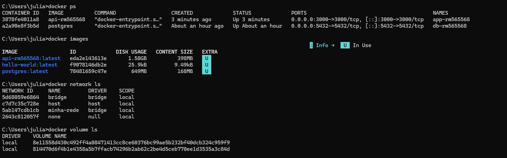

# 🚀 Projeto DevOps - API + PostgreSQL + Docker

## 📌 Descrição
Este projeto consiste em uma API REST desenvolvida em Node.js utilizando Express, conectada a um banco de dados PostgreSQL, ambos executando em containers Docker e comunicando-se através de uma rede Docker.

---

## 🛠️ Tecnologias
- Node.js
- Express
- PostgreSQL
- Docker

## 🐳 Imagens 

- postgres:latest (Docker Hub)
- api custom (build local)
  
---

## ⚙️ Configuração

Crie um arquivo `.env` baseado no `.env.example`:

```bash
DB_HOST=localhost
DB_USER=postgres
DB_PASSWORD=postgres123
DB_NAME=appdb
DB_PORT=5432
```

---

## 🐳 Subindo o ambiente com Docker

### 1. Criar rede Docker

```bash
docker network create minha-rede
```

---

### 2. Subir o banco de dados

```bash
docker run -d --name db-rm565568 \
--network minha-rede \
-v postgres_data:/var/lib/postgresql/data \
-e POSTGRES_PASSWORD=postgres123 \
-e POSTGRES_DB=appdb \
-p 5432:5432 \
postgres
```


---

### 3. Build da API

```bash
docker build -t api-rm565568 .
```


---

### 4. Subir a API

```bash
docker run -d --name app-rm565568
--network minha-rede
-e DB_HOST=db-rm565568
-e DB_USER=postgres
-e DB_PASSWORD=postgres123
-e DB_NAME=appdb
-e DB_PORT=5432
-p 3000:3000
api-rm565568
```

---

## 🌐 Endpoints da API

### ➕ Criar usuário
POST `/usuarios`

Body:

```json
{
"nome": "Usuario1",
"email": "usuario1@email.com"
}
```

---

### 🔍 Listar usuários
GET `/usuarios`

---

### ✏️ Atualizar usuário
PUT `/usuarios/:id`

Body:

```json
{
  "nome": "Novo Nome",
  "email": "novo@email.com"
}
```

---

### 🗑️ Deletar usuário

DELETE `/usuarios/:id`

---

## 📌 Endpoints

POST /usuarios  
GET /usuarios  
PUT /usuarios/:id  
DELETE /usuarios/:id  

---

## 🧪 Testes
A API pode ser testada utilizando ferramentas como:
- Insomnia
- Postman
- Navegador (para GET)

---

## 📸 Evidências



> Execução dos comandos `docker ps`, `docker images` e `docker network ls`

---

## 🎥 Vídeo demonstrativo
https://youtu.be/dqY7OFBqrLM

---

## 📁 Estrutura do projeto

```
api-devops-cp2/
├── app.js
├── Dockerfile
├── package.json
├── .env.example
├── .gitignore

```
---

## ✅ Conclusão
O projeto demonstra a criação de uma arquitetura simples com containers Docker, onde uma API e um banco de dados se comunicam corretamente em uma rede isolada, permitindo operações completas de CRUD.
